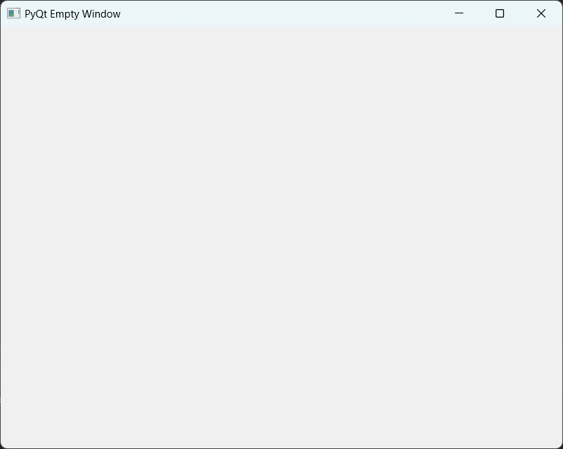

## Installation

To get started with PyQt6, install it using the following command:

```bash
pip install PyQt6
```

---

## Empty Window

### Preview


### Full Code

```python
import sys
from PyQt6.QtWidgets import QApplication, QWidget

class EmptyWindow(QWidget):
    def __init__(self):
        super().__init__()
        self.initializeUI()
    
    def initializeUI(self):
        self.setGeometry(150, 50, 700, 700)
        self.setWindowTitle('Empty Window in PyQt')
        self.show()

if __name__ == '__main__':
    app = QApplication(sys.argv)
    window = EmptyWindow()
    sys.exit(app.exec())
```

### Breakdown of the Code

1. **Import Necessary Modules**
   ```python
   import sys
   from PyQt6.QtWidgets import QApplication, QWidget
   ```

2. **Main Window Class**

   ```python
   class EmptyWindow(QWidget):
   ```

   *Methods within `EmptyWindow`:*

   - **`__init__` Method**  
     Initializes the main window.
     ```python
     def __init__(self):
         super().__init__()
         self.initializeUI()
     ```
     - Calls `initializeUI` to set up the window properties.

   - **`initializeUI` Method**  
     Sets the window size and title, and displays it.
     ```python
     def initializeUI(self):
         self.setGeometry(150, 50, 700, 700)
         self.setWindowTitle('Empty Window in PyQt')
         self.show()
     ```

---

## Basic Text and Images

The following code demonstrates how to add basic text and an image to the window.

```python
import sys
from PyQt6.QtWidgets import QApplication, QWidget, QLabel
from PyQt6.QtGui import QPixmap

class HelloWorldWindow(QWidget):
    def __init__(self):
        super().__init__()
        self.initializeUI()

    def initializeUI(self):
        self.setGeometry(150, 50, 700, 700)
        self.setWindowTitle('QLabel')
        self.displayLabels()
        self.show()

    def displayLabels(self):
        # Display Text
        text = QLabel(self)
        text.setText("Hello")
        text.move(260, 15)

        # Display Image
        image = "world2.png"
        try:
            with open(image):
                world_image = QLabel(self)
                pixmap = QPixmap(image)
                world_image.setPixmap(pixmap)
                world_image.move(25, 40)
        except FileNotFoundError:
            print("Image not found.")

if __name__ == '__main__':
    app = QApplication(sys.argv)
    window = HelloWorldWindow()
    sys.exit(app.exec())
```

### Breakdown of the Code

1. **Import Necessary Modules**

   ```python
   import sys
   from PyQt6.QtWidgets import QApplication, QWidget, QLabel
   from PyQt6.QtGui import QPixmap
   ```
   - Imports `QApplication`, `QWidget`, and `QLabel` from PyQt6 to create the window and display text and images.
   - Imports `QPixmap` to handle images.

2. **Main Window Class**

   ```python
   class HelloWorldWindow(QWidget):
   ```
   - This class inherits from `QWidget`, providing a base for the main application window.

   *Methods within `HelloWorldWindow`:*

   - **`__init__` Method**
     Initializes the main window and calls `initializeUI`.
     ```python
     def __init__(self):
         super().__init__()
         self.initializeUI()
     ```

   - **`initializeUI` Method**
     Sets the geometry, title, and displays the window. Calls `displayLabels` to add content.
     ```python
     def initializeUI(self):
         self.setGeometry(150, 50, 700, 700)
         self.setWindowTitle('QLabel')
         self.displayLabels()
         self.show()
     ```

   - **`displayLabels` Method**
     Adds a text label and an image to the window.

     - **Display Text**  
       Creates a label for text and positions it on the window.
       ```python
       text = QLabel(self)
       text.setText("Hello")
       text.move(260, 15)
       ```

     - **Display Image**  
       Loads and displays an image file. If the image is not found, it prints an error.
       ```python
       image = "world2.png"
       try:
           with open(image):
               world_image = QLabel(self)
               pixmap = QPixmap(image)
               world_image.setPixmap(pixmap)
               world_image.move(25, 40)
       except FileNotFoundError:
           print("Image not found.")
       ```

3. **Application Execution**
   Starts the application by creating an instance of `QApplication` and running the window.
   ```python
   if __name__ == '__main__':
       app = QApplication(sys.argv)
       window = HelloWorldWindow()
       sys.exit(app.exec())
   ```


## Basic Button
Here's a basic example of how to create a simple window with a button using PyQt6. When the button is clicked, it will display a message in the console.

```python
import sys
from PyQt6.QtWidgets import QApplication, QWidget, QPushButton, QVBoxLayout

class BasicButtonExample(QWidget):
    def __init__(self):
        super().__init__()

        # Set window title
        self.setWindowTitle("Basic Button Example")
        self.setGeometry(150, 50, 700, 700,)
        
        # Create a button and connect it to a function
        button = QPushButton("Click Me")
        button.clicked.connect(self.on_button_click)

        # Set up the layout and add the button to it
        layout = QVBoxLayout()
        layout.addWidget(button)
        self.setLayout(layout)

    def on_button_click(self):
        # This function will be called when the button is clicked
        print("Button was clicked!")

if __name__ = "__main__":
    # Create the application instance and the main window
    app = QApplication(sys.argv)
    window = BasicButtonExample()

    # Run the application's event loop
    sys.exit(app.exec())
```

### Explanation

1. **`QApplication`**: Initializes the application and handles the event loop.
2. **`QWidget`**: The base class for all UI objects. Here, it’s the main window.
3. **`QPushButton`**: Creates a button labeled "Click Me".
4. **`.clicked.connect(self.on_button_click)`**: Connects the button's click event to the `on_button_click` method, which prints "Button was clicked!" to the console.
5. **`QVBoxLayout`**: A layout to organize the button inside the 


## QLineEdit